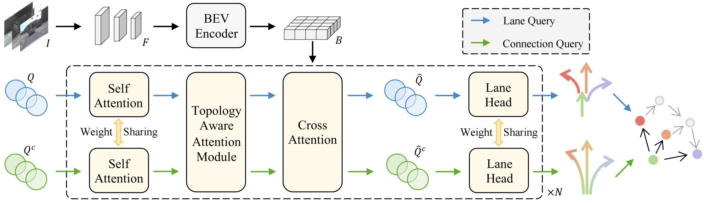
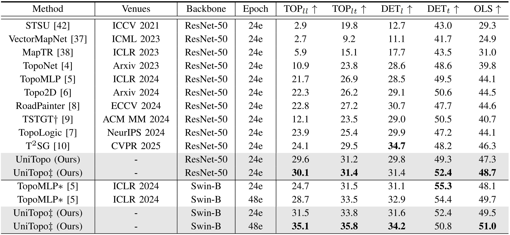
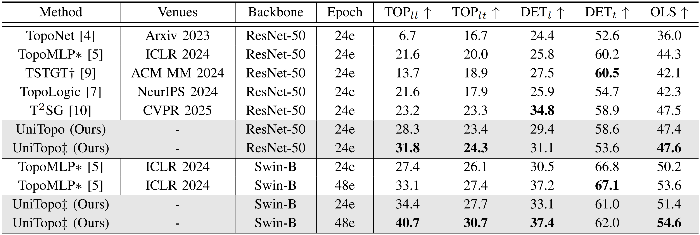

# UniTopo
This repo is the official PyTorch implementation for paper: [Unified Modeling of Lane and Lane Topology for Driving Scene Reasoning](https://ieeexplore.ieee.org/document/11506407).



Autonomous vehicles need to perceive not only physical elements in the driving scene, such as lane lines and traffic lights, but also logical elements like lane centerlines and their topology.
Existing lane topology reasoning methods typically follow a reasoning-by-detection paradigm, where lane topological relationships are primarily derived from lane detection results.
In this paper, we propose an innovative method called Unified Modeling of Lane and Lane Topology (UniTopo), which represents the topological relationships between lanes as connected lanes, encompassing predecessor lanes, successor lanes, and their interconnections.
This unified representation of lanes and lane topology allows us to simultaneously obtain both the positions and topological information of lanes within a shared perception pipeline, establishing a new paradigm for directly perceiving lane topology from original image features.
We validate our method on the driving scene reasoning benchmark OpenLane-V2, which consists of two subsets, built based on Argoverse2 and nuScenes, respectively.
Our method achieves $\text{TOP}_{ll}$ of 30.1\% and 31.8\% on the two subsets, significantly surpassing the existing state-of-the-art method TopoFormer by 6.0\% and 8.6\%.

## Table of Contents
- [Installation](#Installation)
- [Prepare Dataset](#Prepare-Dataset)
- [Train and Evaluate](#Train-and-Evaluate)
- [Main Results](#Main-Results)
- [Citation](#Citation)
- [Acknowledgement](#Acknowledgement)

## Installation

Our code is developed with **Python 3.8.10** and **CUDA 11.8**. The full list of required dependencies can be found in `requirements.txt`.

## Prepare Dataset

For the OpenLane-V2 dataset, please follow the instructions in
[README.md](https://github.com/OpenDriveLab/OpenLane-V2/blob/master/data/README.md) to download and preprocess the data. After preprocessing, the dataset should be organized as follows:
```
data
└── OpenLane-V2
    ├── data_dict_subset_A.json
    ├── data_dict_subset_A_test.pkl
    ├── data_dict_subset_A_train.pkl
    ├── data_dict_subset_A_val.pkl
    ├── data_dict_subset_B.json
    ├── data_dict_subset_B_test.pkl
    ├── data_dict_subset_B_train.pkl
    ├── data_dict_subset_B_val.pkl
    ├── preprocess.py
    ├── test
    ├── train
    └── val
```

## Train and Evaluate

### Prepare pretrained models.

```shell
mkdir ckpts
cd ckpts 
wget https://download.pytorch.org/models/resnet50-19c8e357.pth
wget https://github.com/SwinTransformer/storage/releases/download/v1.0.0/swin_base_patch4_window12_384_22k.pth
```

### Train UniTopo with 8 GPUs.
```shell
bash tools/dist_train.sh unitopo_subset_a 8      # subset_A
bash tools/dist_train.sh unitopo_subset_b 8      # subset_B
```

### Evaluate UniTopo with 8 GPUs.
```shell
bash tools/dist_test.sh unitopo_subset_a 8       # subset_A
bash tools/dist_test.sh unitopo_subset_b 8       # subset_B 
```

## Main Results

### Results on OpenLane-V2 *subset_A*.

[[config](projects/configs/unitopo_subset_a.py)] [[ckpt](https://drive.google.com/file/d/1zBWta7Z1sUf9Z0teYRP6gOO-dH2TEGDf/view?usp=sharing)]



### Results on OpenLane-V2 *subset_B*.

[[config](projects/configs/unitopo_subset_b.py)] [[ckpt](https://drive.google.com/file/d/1BnnfN0x02C1S86W6DKeIdfs-jymbV8lc/view?usp=sharing)]



$*$: The results are re-implemented by us based on the open-source code of TopoMLP.

$\dagger$: The results for TSTGT are cited from their paper, which uses outdated metrics due to the unavailability of open-source code.

$\ddagger$: UniTopo is built upon the well-recognized baseline TopoNet, while UniTopo $\ddagger$ is implemented with TopoLogic as the baseline.

## Citation
If you find this repo useful for your research, please consider citing it using the following BibTeX entry.

```
@ARTICLE{UniTopo,
  author={Li, Han and Gao, Yulu and Liu, Si and Wang, Yuhang and Liu, Bo and Mu, Beipeng},
  journal={IEEE Transactions on Circuits and Systems for Video Technology}, 
  title={Unified Modeling of Lane and Lane Topology for Driving Scene Reasoning}, 
  year={2026},
  doi={10.1109/TCSVT.2026.3690152}
}
```

## Acknowledgement
We thank the authors that open the following projects.
- [OpenLane-v2](https://github.com/OpenDriveLab/OpenLane-V2)
- [TopoNet](https://github.com/OpenDriveLab/TopoNet)
- [TopoMLP](https://github.com/wudongming97/TopoMLP)
- [TopoLogic](https://github.com/Franpin/TopoLogic)
